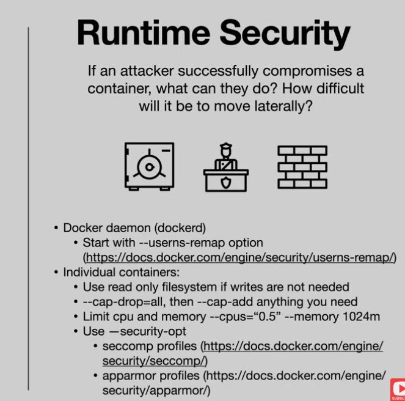

first create docker compose file called docker-compose.yaml. It should look something like this 

services:
  client-react-vite:
    image: client-react-vite
    build:
      context: ../05-example-web-application/client-react/
      dockerfile: ../../06-building-container-images/client-react/Dockerfile.3
    init: true
    volumes:
      - ./client-react/vite.config.js:/usr/src/app/vite.config.js
    networks:
      - frontend
    ports:
      - 5173:5173

then run docker compose build, then docker compuse up

might need for when agents run in docker containers

